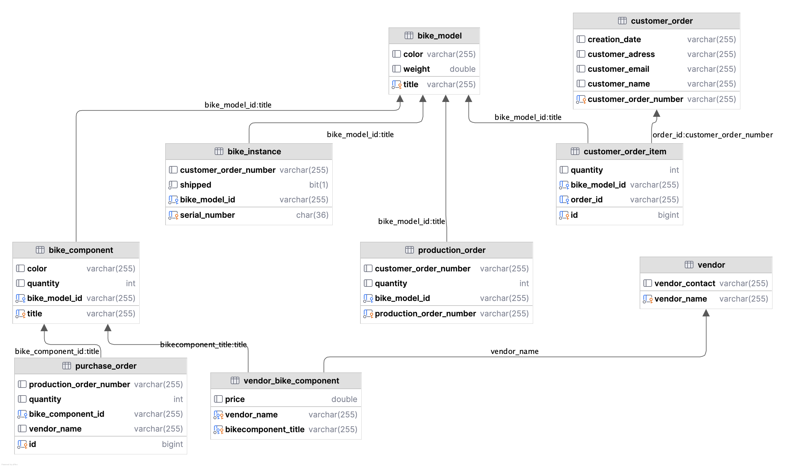
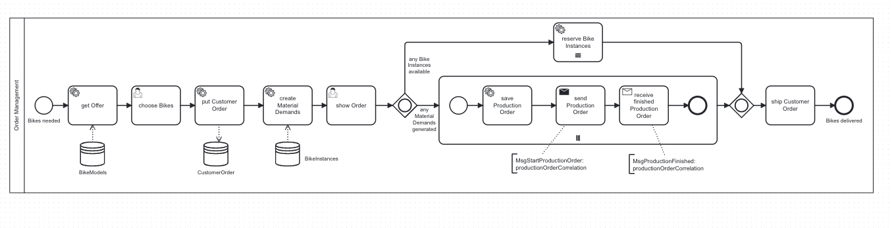

# BPA Lab Bicycle Manufacturing Factory

The Business Process Automation Lab (BPA Lab) at the TH Cologne is a small and modular model factory focusing on business process automation and analytics. One of its goals is to demonstrate modern concepts and technologies for the automation and analysis of business processes to different stakeholders (companies, students, ...).

This repository contains the source code and configuration files of the implementation of the demonstration scenario: the ordering, production, purchasing, manufacturing and shipping of custom-made bicycles. The implementation is based on Camunda 8, a Business Process Management System. This BPMS orchestrates different job workers for different processes. Moreover, the robots for the warehouse operations like storing or retrieving items are implemented in Python.

## state of affairs

## Prerequisites

-> Docker desktop application based on your system preference (Windows/macOS)
or Docker nativ (Linux)

-> mysql9 

### Database scheme

#### Run
    docker compose -f docker-compose.yaml up -d
to start Mysql DBMS with [./sql/initdb.sql](./sql/initdb.sql) and Camunda self-managed

### BPALabBikeFactoryOrderManagement
    jdk21 spring-boot-starter-camunda-sdk(c8) mysql(9) gradle
- Application creates/updates database with hibernate/jpa on startup except
  PurchaseOrder table, Vendor table and Vendor-BikeComponent table
- Deploys bpmn/BPALabBikeFactoryOrderManagement.bpmn, bpmn/ChooseBikesForm.form, bpmn/ShowOrderForm.form

#### Run
in ./bpa_lab_ordermanagement_process
    
    gradle bootRun

### BPALabBikeFactoryProduction
    jdk21 spring-boot-starter-camunda-sdk(c8) mysql(9) gradle
- called per message, creates Production Order and Bike Instances from Bike Model,
  decreases Bike Component quantity, reserves them for Order Number
- started with User Task, creates Production Order and Bike Instances from Bike Model,
  decreases Bike Component quantity and doesn't reserve
- Deploys bpmn/BPALabBikeFactoryProductionControl.bpmn, bpmn/bpa_lab_production_process_start.form

#### Run

in ./bpa_lab_productioncontrol_process

    gradle bootRun

### BPALabBikeFactoryPurchase
    nodejs(v23.10.0) typescript mysql(9) @camunda8/sdk
- called per message, creates Purchase Order and increases Bike Component quantity
- started with User Task, creates Purchase Order and increases Bike Component quantity
- Deploys bpmn/bpa_lab_purchase_process.bpmn, bpmn/bpa_lab_purchase_process_start.form, bpmn/chooseVendor.form

#### Run
in ./bpa_lab_purchasing_process

    npm run start

### BPALabBikeFactoryManufacture
    jdk21 spring-boot-starter-camunda-sdk(c8) mysql(9) gradle
- sends mqtt messages to and receives mqtt messages from Fischertechnik fabric
- fakes manufacturing if no connection to mqtt broker available
- Deploys bpmn/BPALabBikeFactoryManufacture.bpmn, bpmn/BPALabBikeFactoryManufactureOrder.form

#### Run

in ./bpa_lab_manufacturing_process

    gradle bootRun

### BPALabBikeFactoryShipment
    nodejs(v23.10.0) typescript mysql(9) @camunda8/sdk

- called per message, sets Bike Instances with Order Number to shipped
- started with User Task, searches Bike Instances with no Order Number and not shipped and sets chosen to shipped
- Deploys bpmn/bpa_lab_shipment-process.bpmn, bpmn/shipmentInputData.form, bpmn/checkInformation.form

#### Run
in ./bpa_lab_shipment_process

    npm run start

### Containerisation

    docker compose -f docker-compose-processes.yaml up -d

starts 
- Mysql DBMS with [./sql/initdb.sql](./sql/initdb.sql) 
- Camunda self-managed
- runs 

    `BPALabBikeFactoryOrderManagement`, 

    `BPALabBikeFactoryProduction`,

    `BPALabBikeFactoryPurchase`,

    `BPALabBikeFactoryManufacture`,

    `BPALabBikeFactoryShipment`

as Docker Container

## state of affairs (things not working)
- ???