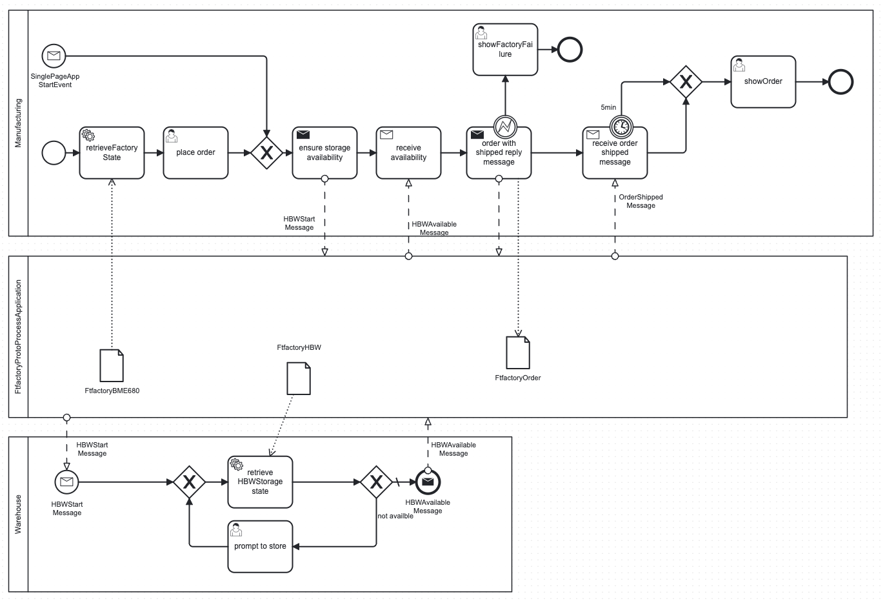
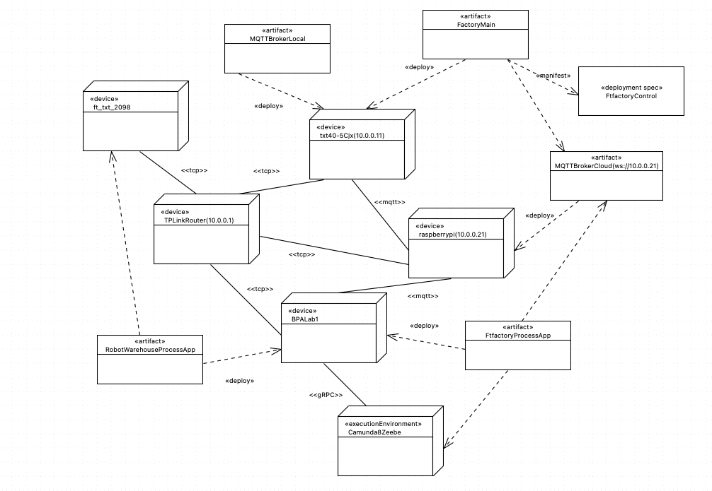
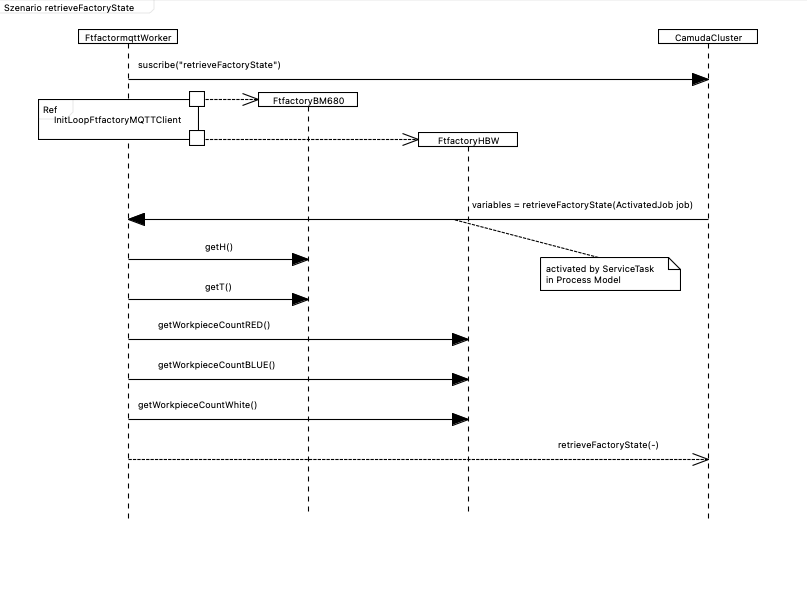
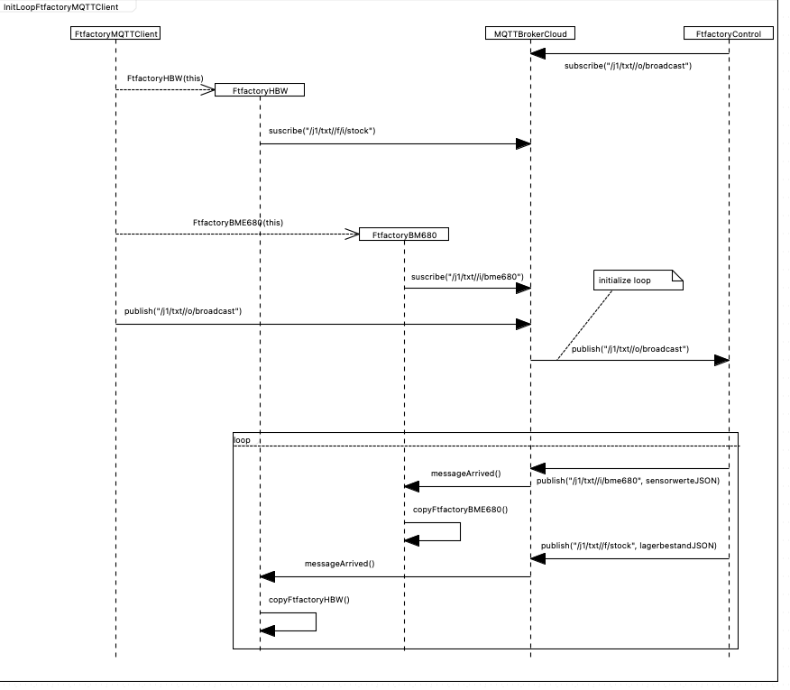

# Ftfactory Zeebe Mqtt Process Application

This project contains a **process application** (ZeebeMqttBridge) 

with **Camunda8 jobworker** connecting

 **BPMN service task** (retrieve factory state, retrieve HBWStorage state) or
 
 **BPMN message send tasks** (ensure storage availability, order with shipped reply message)
 
 to a **mqtt broker** (MQTTBrokerCloud)

interchanging messages with **ft txt4.0 Controler** (FtfactoryControl).

### Procedure

- start mqtt-broker
- start FtfactoryControl(FactoryMain) on **ft txt4.0 Controler**
	- without connection to Ftfactory use an mqtt client alternative, see [doc/HELP.md](doc/HELP.md "HELP.md")

- start ZeebeMqttBridge, see [doc/HELP.md](doc/HELP.md "HELP.md")
- start Process [(bpalab_Order)](src/workflow/bpalab_Order.bpmn) in Camunda Cloud 
- (alternative use localhost:8090/ to use SinglePageApp message start event)
- work with **tasklist / operate** in Camunda Cloud 

### Constraints

- ZeebeMqttBridge needs access to local LAN *(for mqtt-broker)* **and** Internet *(for zeebeClient)*
- serves only ONE process instance *(Order)* at a time
- ... You tell me

##### BPMN Collaboration diagram

##### Deployment diagram

##### Sequence diagrams
*!!! mqtt messages outdated !!!*

