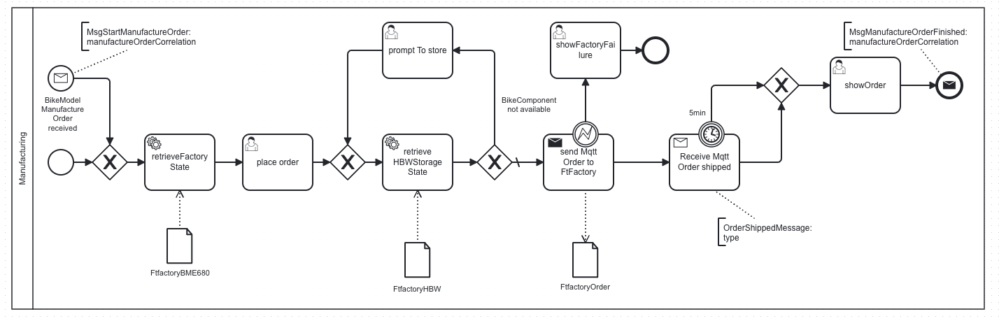
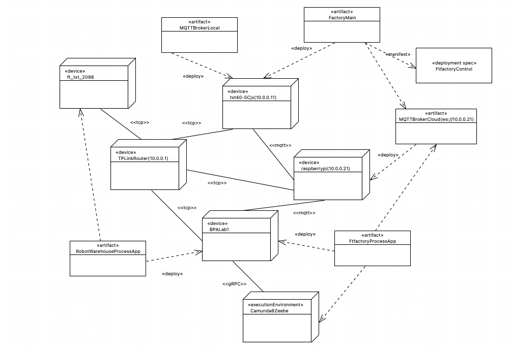
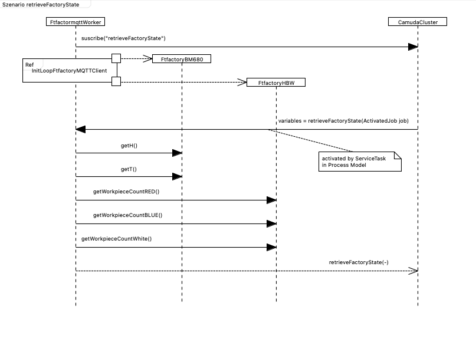
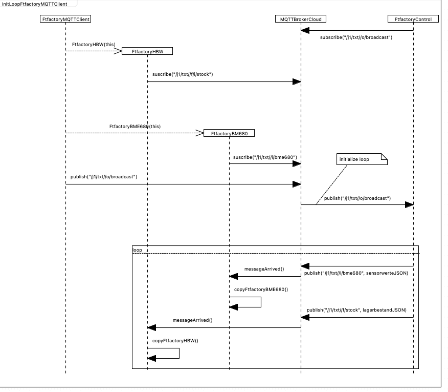

# Ftfactory Camunda8 Mqtt Process Application

This project contains a **process application** (BpaLabManufacturingApplication) 

with **Camunda8 jobworker** connecting

 **BPMN service task** (retrieve factory state, retrieve HBWStorage state) or
 
 **BPMN message send tasks** (send Manufacture Order)
 
 to a **mqtt broker** (FtfactoryMQTTClient)

interchanging messages with **ft txt4.0 Controler** (FtfactoryControl).

### Procedure

- start mqtt-broker
- start FtfactoryControl(FactoryMain) on **ft txt4.0 Controler**
	- without connection to Ftfactory use an mqtt client alternative, see [doc/HELP.md](doc/HELP.md "HELP.md")

- start BpaLabManufacturingApplication, see [doc/HELP.md](doc/HELP.md "HELP.md")
    - without connection to mqtt broker application fakes manufacturing 

- start Process [(BPALabBikeFactoryManufacture)](bpmn/BPALabBikeFactoryManufacture.bpmn) in Camunda 
- work with **tasklist / operate** in Camunda Apps

### Constraints

- BpaLabManufacturingApplication needs access to local LAN *Camunda self-managed*
  - **OR** BpaLabManufacturingApplication needs access to Internet for *Camunda cloud*
- serves only ONE process instance *(Order)* at a time
- ... You tell me

##### BPMN Collaboration diagram

##### Deployment diagram

##### Sequence diagrams
*!!! mqtt messages outdated !!!*

