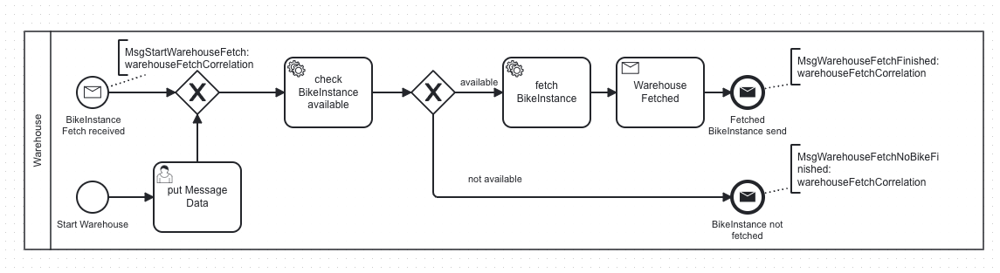
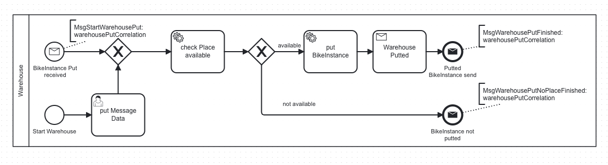

## Run process applications separately from the Camunda/MySQL containers
As an alternative, Camunda and MySQL can be deployed on docker while process applications may be executed separatly.

#### Run
    docker compose -f docker-compose.yaml up -d
to start Camunda self-managed without process applications

and Mysql DBMS with [./sql/initdb.sql](./sql/initdb.sql) *(not used here)*

### BPALabBikeFactoryWarehouse
    jdk21 spring-boot-starter-camunda-sdk(c8) gradle
- sends mqtt messages(***put/get***) to and receives mqtt messages(info,fetched,putted) from TXT_Warehouse
- Deploys bpmn/BPALabBikeFactoryWarehouseFetch.bpmn, ./bpmn/BPALabBikeFactoryWarehouseFetchForm.form

- Deploys bpmn/BPALabBikeFactoryWarehousePut.bpmn, ./bpmn/BPALabBikeFactoryWarehousePutForm.form

#### Run

in ./bpa_lab_warehouse_process

    gradle bootRun
